# Next JS crash course

## Routing : creation de routes

Le systeme de routing de Next.js est basé sur le système de fichier. Le repertoire app est le point d'entrée de l'application. Les fichiers dans ce repertoire sont accessibles via l'url racine de l'application.

- **Role des dossiers** : c'est de definir les routes de l'application. Une route est un enchainement de dossiers imbriqués.
- **Role des fichiers** : c'est de definir le contenu de la page.

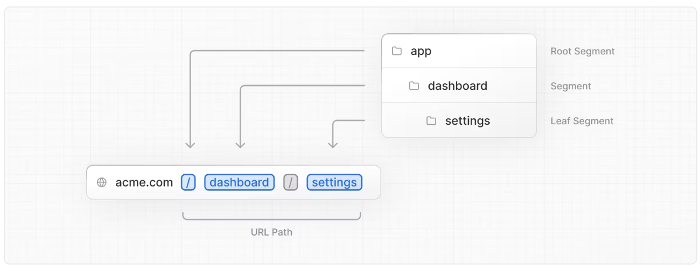

Next fournit toute une liste de dossier et de fichier pour definir les routes de l'application.

Voici la liste des fichiers dont le nom est réservé pour definir les routes de l'application:
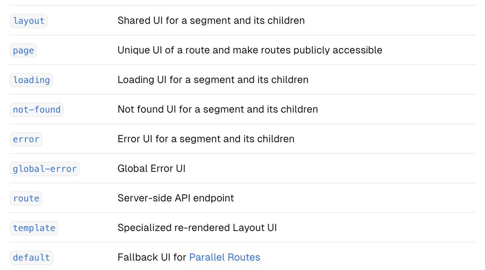

Pour créer une router imbriquée, il suffit d'imbriquer des dossiers. Par exemple, pour créer une route /about, il suffit de créer un dossier about dans le dossier app et de creer le composant `route.tsx` dans ce dossier.

## Routing: Pages & Layout

### Pages

Une page c'est l'UI associé à une route. Dans le code on la représente par un composant React exporté par un fichier appelé `route.tsx`.

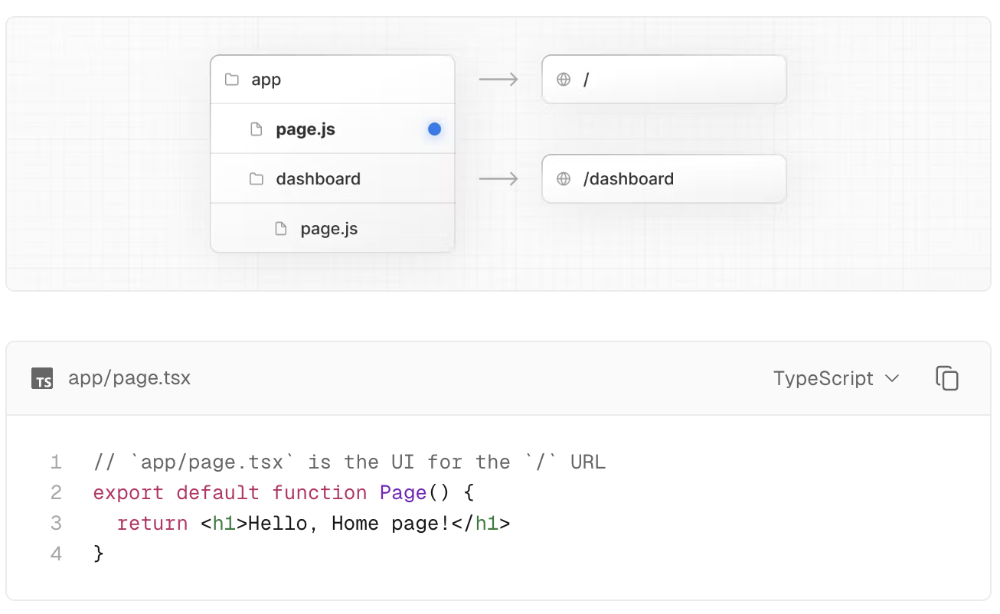

Par defaut toutes les pages sont des composants Server, il faut utiliser 'use client' pour les rendre des composants client.

### Layout

Un Layout est une partie d'UI partagée entre plusieurs pages. Par exemple, un header, un footer, une sidebar, etc. Son but est de préservé la cohérence de l'UI entre les pages. On ne modifie pas le layout à chaque changement de page.

Comme les pages on peut imbriquer des layouts. Par exemple, un layout peut contenir un autre layout.

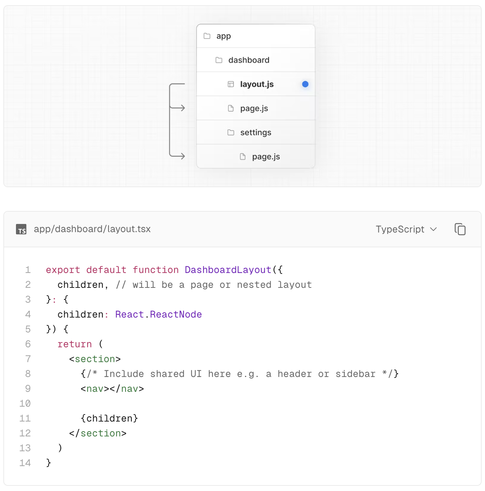

Pour créer un layout, il suffit de créer un composant React exporté par un fichier appelé `layout.tsx`.
Le root layout est obligatoire. Il doit forcément contenir les tags : `html` et `body`.
Il est possible de crée un layout pour chaque pages, mais il est aussi possible de créer un layout pour un groupe de pages.

#### Imbriquer des layouts

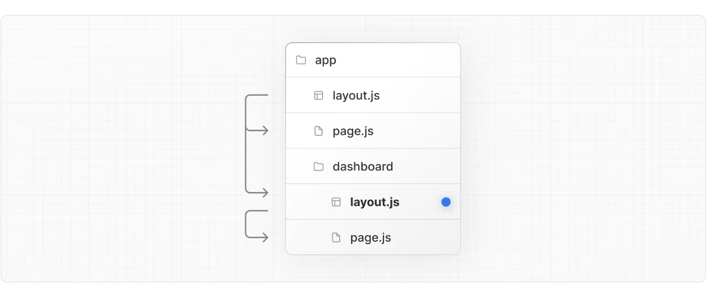

#### Grouper des routes : `Route Groups`

A l'interieur du repertoire on peut directement mapper l'imbrication des dossiers sur les routes de l'application. Il est possible de creer des dossiers speciaux (route group) qui seront ignores par le routing Next.

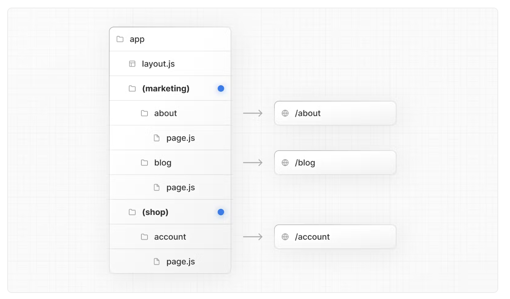

On peut ainsi creer un layout pour un groupe de pages.

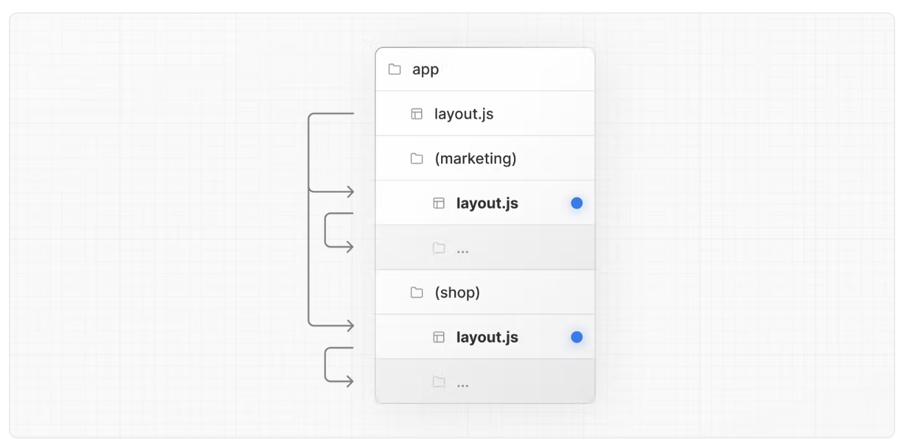

Ou encore plusieurs root layout:

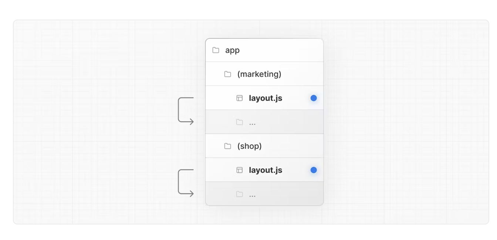

#### Routes dynamiques

Pour creer une route dynamique, il suffit de creer un dossier dont le nom est entre crochets. Par exemple [id], cette information sera passée a la props `params` des fonctions : page, route, layout et generateMetadata.

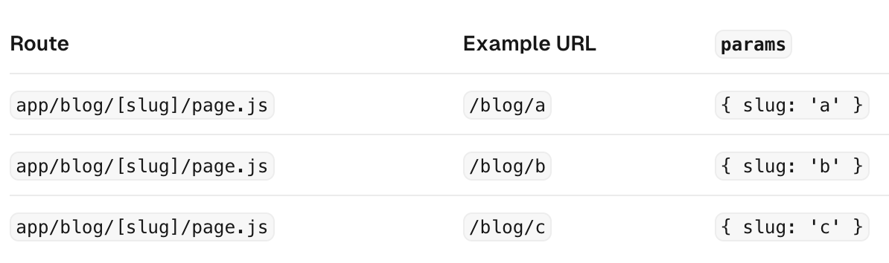

Dans l'exemple ci-dessus, on peut recuperer la valeur de [slug] de cette maniere dans le composant `page.tsx`:

```tsx
export default function Page({ params }: { params: { slug: string } }) {
  return <h1>Page {params.slug}</h1>;
}
```

##### Le segment de route dynamique `catch-all`

On peut aussi rendre dynamique le nombre de parametre au sein d'une route dynamique, pour cela il faut preceder le nom de la route dynamique par `...`.
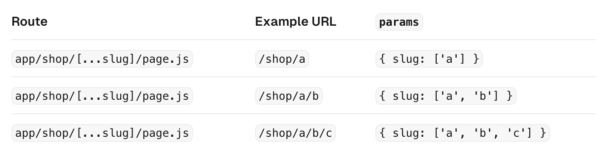

## Routing: Navigation

Il existe 4 methodes pour naviguer entre les pages:

- **Link** : composant
- **useRouter** : hook
- **Redirect** : fonction
- l'API History

### Link

Link est un composant fournit par Next qui est en realite un wrapper autour de la balise html `<a>`. Il permet de naviguer entre les pages sans recharger la page.

```tsx
import Link from "next/link";

export default function Page() {
  return <Link href="/about">About</Link>;
}
```

#### Le hook usePathname

Le hook usePathname permet de recuperer le pathname de la page courante. Il permet par exemple de mettre en surbrillance le lien de la page courante. Pour utiliser un hook au sein d'un composant Next il faut utiliser la directive `use client`.

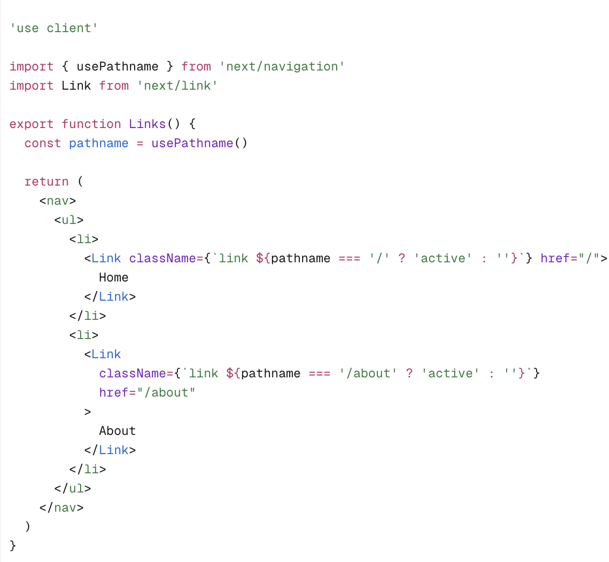

### Le hook useRouter

Ce hook permet de changer par le code la route courante de l'application. Il permet aussi de recuperer les parametres de la route courante.
